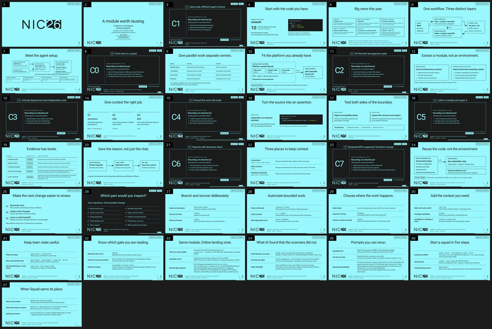

# GitHub Copilot CLI and Squad for Terraform

A two-speaker session by **Martin Opedal, Enterprise Cloud Solution Architect, Microsoft** and **Haflidi Fridthjofsson, Sr Cloud Solution Architect, Microsoft** on using GitHub Copilot CLI and Squad together to build, check, and review Terraform for Azure.

**Session:** October 14, 2026, 10:00-11:00, UTC+02:00, Room 6.

## What this repository contains

The presentation shell and speaker material are built and reviewed. The public Terraform module passed local qualification: 52 module cases, two caller cases, two fail-restore-pass mutation evidence checks, hosted Terraform matrix CI, native agent-setup CI, and an IaC-based Azure validation in a private Corp landing-zone consumer. Optional fallback recordings, native profile-selection footage, and full human rehearsal remain separate verification tasks.

| Path | Content |
| --- | --- |
| [`presentation`](presentation/README.md) | Offline-capable Reveal.js presentation with speaker notes |
| [`docs\talk-track.md`](docs/talk-track.md) | Timed Martin/Haflidi script, handoffs, and prepared Q&A |
| [`docs\run-plan.md`](docs/run-plan.md) | Countdown, recording plan, minute-by-minute run sheet, preflight, fallbacks |
| [`docs\clean-machine-demo.md`](docs/clean-machine-demo.md) | C0: from-zero Copilot CLI and Squad install on the clean demo VM |
| [`docs\sessionize.md`](docs/sessionize.md) | Updated title, abstract, outcomes, pitch, and speaker metadata |
| [`docs\feature-guide.md`](docs/feature-guide.md) | Source-verified Copilot CLI and Squad features and practical use cases |
| [`docs\prompt-pack.md`](docs/prompt-pack.md) | Rerunnable prompts for building a module like this with Squad, the native lanes, and MCP |
| [`docs\determinism-eval.md`](docs/determinism-eval.md) | Repeatability eval for three bounded Terraform briefs, including misses and oracle rules |
| [`docs\playbook.md`](docs/playbook.md) | Verified step-by-step playbook for bootstrapping Squad, using the native Terraform agents, repeatability prompts, and the demo-env handoff |
| [`docs\online-demo.md`](docs/online-demo.md) | Appendix: the reusable module consumed by the demo-env repo in an ALZ Online subscription through a gated pipeline, with branded hostname-page evidence and a 29/29 Online security-check pass |
| `scripts\recording\` | Controlled-window capture and verification tools |
| `terraform\modules\aks-automatic-corp\` | Public source copy of the independently versioned demo module |

The module's separate repository is [terraform-azapi-aks-automatic-corp](https://github.com/alz-avm-tf-demo/terraform-azapi-aks-automatic-corp), pinned here to `b01256eb9b1ea6046b9bb8a403662f724a7b6fa7`. The [source manifest](terraform/module-source.json) binds the matching presentation copy. See the module's [qualification summary](terraform/modules/aks-automatic-corp/VALIDATION.md) for the exact boundary.

That manifest identifies the published module-copy binding. Azure validation used private consumer code pinned to runtime module commit `02e10e56bc15cc30c3193dce3ddc8e608cb87daf`; this docs-only module revision records the result without publishing private inputs.

The [C0-C7 operator runbook](docs/demo-runbook.md) provides current-shell commands, native prompts, speaker handoffs, and recording checkpoints; C0 runs on the clean demo VM per [clean-machine-demo.md](docs/clean-machine-demo.md). Use it for the later genuine clean demonstration, not as a claim that the recording already exists.

## Native agents alongside the existing Squad

[CONTRIBUTING.md](CONTRIBUTING.md) wires the file-backed
[terraform-coder](.github/agents/terraform-coder.agent.md),
[terraform-validator](.github/agents/terraform-validator.agent.md), and
[terraform-reviewer](.github/agents/terraform-reviewer.agent.md) into the
existing [Squad routing](.squad/routing.md). Select them through `/agent` in the
current CLI window; do not reinstall Squad. Root profiles are needed for root
discovery even though the module copy contains the same supporting files.

The coder has `read`, `search`, `edit`, and selected read-only MCP docs tools.
The validator has `read`, `search`, and `execute`, is manual-selection only, and
has no `edit` tool, but its shell can still write files; the command list is
enforced only by its instructions and native approval prompts. The reviewer has
`read`, `search`, and selected read-only MCP docs tools. Squad scopes and receives the
handoff; the human maintainer owns acceptance. Native permission prompts and
separate publication/private-consumer apply gates remain in place.

Coder and reviewer ground claims through Microsoft Learn and Terraform Registry
MCP servers. MCP policy is hosted first: Microsoft Learn is cloud-hosted. The demo uses a
Docker-run Terraform MCP server pinned for this session; HashiCorp documents
local deployment (including Docker) and self-hosted transports. Docker Desktop and network access are required for
Learn/registry docs. Copilot CLI and Copilot cloud agent honor `mcp-servers`; VS
Code ignores that frontmatter. MCP results are documentation lookups, not
validation or Azure acceptance. The native Terraform MCP binary is not used for
this demo.

The [qualification skill](.github/skills/qualify-agent-setup/SKILL.md) provides
executable static and negative checks using existing Node.js and Git:

```powershell
node .github\skills\qualify-agent-setup\check.mjs
node --test .github\skills\qualify-agent-setup\check.test.mjs
```

These checks provide evidence for setup integrity, not a genuine native agent run, MCP server
startup, independent review, or Azure acceptance. See the contributing guide for
full module-copy comparison.

## Open the presentation

[](https://martinopedal.github.io/squad-terraform-session-2026-10-14/presentation/)

The built [Reveal presentation](presentation/index.html) ([slide-by-slide preview](presentation/README.md#preview)) reports 39 slides total. Its 60-minute live-first contract is 3:00 intro; planned content to about 55:00, including 29:00 of live C0-C7 demo chapters and the rest as live explanation; 55:00-58:00 protected recovery block; and 58:00-60:00 close, with questions only if time allows. There is no scheduled Q&A block. See [docs/run-plan.md](docs/run-plan.md) for the full minute-by-minute schedule.

For speaker notes, serve the clone locally:

```powershell
python -m http.server 4173 --bind 127.0.0.1
```

Open `http://127.0.0.1:4173/presentation/` and press `S` for speaker view or `N` for named chapter navigation. Optional fallback evidence can be added later if it is separately reviewed, but the live chapters do not depend on recordings. No custom file-viewer footage is presented as Copilot CLI or Squad.

## Public code, separate deployment configuration

The module and its generic examples are public. Real subscription/resource identifiers, environment inputs, credentials, private policy evidence, and Terraform state remain outside this repository.

The reusable public module is [`martinopedal/terraform-azapi-aks-automatic`](https://github.com/martinopedal/terraform-azapi-aks-automatic). Demo-environment roots, manifests, operational scripts, and gated deployment workflows now live in [`martinopedal/aks-automatic-demo-env`](https://github.com/martinopedal/aks-automatic-demo-env), which pins the module by tag `v0.6.0`.

The demonstration reuses an existing Azure Landing Zones Corp environment. The public module consumes approved platform resources; it does not deploy a new landing zone or import existing estate resources. The October 5 validation ran through a private platform pull-request workflow and publishes only sanitized results.

## Evidence boundary

The starting AKS root configuration has known validation and documentation issues. It is not a verified deployable module. The project records the actual implementation and repair work, then keeps code checks, Azure deployment evidence, and presentation evidence separate.

Format, lint, and mocked tests remain separate from Azure service acceptance. The October 5 private validation supplied one approved Corp target, reviewed PR plan/apply, and ARM read-back; later environments still require their own plan, policy, identity, DNS, routing, and cleanup evidence.

The user approved code-first qualification followed by a genuine clean recorded run from a disclosed checkpoint. Earlier unrecorded work will not be relabeled as footage.

No completed recordings, native profile-selection footage, or full human rehearsal are claimed by the current build. The Azure claim is limited to the sanitized private IaC validation summarized above. Read [QUALITY.md](QUALITY.md) and [PUBLICATION.md](PUBLICATION.md) for the evidence and release boundaries.
