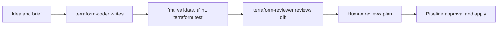

# Overview: how the 60-minute session flows

This session shows a safe way to use GitHub Copilot CLI and Squad for Terraform work. The demo target is a private AKS module and a consumer page. The session is about controlling AI work from idea to reviewed change.

AI can write Terraform fast, but the output can vary between runs. That makes infrastructure work risky if a team accepts the first answer without checks. Our idea is simple: give the work small roles, ground claims in current sources, and keep the same gates a human change would face.

Copilot CLI is the workbench. We use three small profiles. `terraform-coder` writes the agreed change. `terraform-validator` runs fixed offline checks such as `terraform fmt -check -recursive`, `terraform validate -no-color`, `tflint`, and `terraform test`. `terraform-reviewer` reviews the final diff in a fresh context. Microsoft Learn MCP and the pinned Terraform MCP supply source lookups. Agent-written code and human-written code still go through plan review, required review, and environment approval before apply.

Squad is the coordinator. It gives the repo a roster, routing, handoffs, and decision files. That lets several agents work in parallel, keeps one owner per shared surface, and saves the reasons so the next session can resume with the same constraints.

## Live demo chapters

- C0, 05:30-08:30, From zero to a squad. Haflidi installs and boots the tools on a clean VM.
- C1, 12:30-15:30, Same task, fixed inputs. Martin runs the same brief twice to show why wording matters.
- C2, 17:30-21:30, Pin the brief and approve a plan. Martin gets a human-approved plan before edits.
- C3, 22:00-26:00, Assign one writer. Martin routes the clarified brief to `terraform-coder`.
- C4, 29:30-33:30, Ground the work with guidance and source. Martin adds skill guidance and MCP source lookup.
- C5, 33:30-38:30, Catch a mistake and repair it. Haflidi uses `terraform-validator`, seeds a failure, then repairs it.
- C6, 42:00-45:00, Resume with decisions intact. Haflidi shows how Squad decisions survive a resumed session.
- C7, 47:00-50:00, Reviewed diff to approved Terraform change. Haflidi leads validation and review, while Martin states the boundary to the environment owner.

In the Oct 8 repeatability eval, B1v2 was 5/5 green, B2 was 5/5 green, and B3 was 4/5 green after a disclosed harness-bug rescore from saved diffs, with one run still red for an out-of-scope README edit.

Martin drives plan, coding, source lookup, the consumer reveal, and the close. Haflidi drives bootstrap, contract framing, validation, repair, resume, review, and the limits slide.

