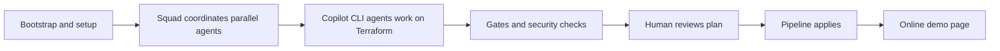

# Overview: the session in five steps

For the minute-by-minute script, see [`docs\talk-track.md`](talk-track.md) and [`docs\run-plan.md`](run-plan.md). This page is the short topic map for colleagues who already know the products.

The session is about using GitHub Copilot CLI and Squad to make Terraform work easier to review. The risk is that AI can produce different answers from the same starting point. The answer is not blind trust. The answer is a clear flow, small roles, grounded source lookups, and the same gates a human change would face.

1. Bootstrap on a clean VM, then move to the presenter setup.

   Haflidi drives C0 on the clean Windows 11 demo VM. He shows install, login, `copilot`, `squad init`, and the basic getting-started path. Martin adds the boundary that setup is useful, but it is not Terraform correctness. After C0, the session continues in the prepared presenter flow.

2. Show the working model in Copilot CLI and Squad.

   Martin covers the CLI surface, the three Terraform lanes, and the handoff into the repo guidance. Haflidi explains Squad as the coordination layer with routing, handoffs, decisions, and one owner per shared surface. This is where the audience sees how the team is organized before any deeper Terraform point.

3. Start from a finished, qualified module and explain why the gates matter.

   Martin introduces the inherited public module revision and the consumer view. Haflidi explains the module boundary, caller-owned provider and state, and the fact that local checks and Azure runtime evidence answer different questions. The security story sits here: pull requests, protected `main`, required review, environment approval, OIDC, runtime checks, and GHAS controls such as CodeQL, secret scanning, and Dependabot. The determinism point also sits here. C1 and the eval show why the brief must be precise. The logged eval result is B1v2 5/5, B2 5/5, and B3 4/5.

4. Show the framework pieces that make the flow work.

   Martin shows agents, skills, MCP source lookups, and permissions. Haflidi explains the difference between instructions, skills, and MCP, plus the reviewer and validator boundaries. The current docs ground this with Microsoft Learn MCP and the pinned Terraform MCP setup used in the demo.

5. End with the Azure output and the optional extra.

   Martin shows the Online consumer page, `AKS Automatic | NIC 2026 demo`. Haflidi maps that result back to the same gate flow. Any extra segment about Squad on ACA is to agree. It is not part of the current run plan or talk track.

