# Present and maintain the deck

Martin, Haflidi, and the presentation operator can use this directory to build, rehearse, and deliver the offline Reveal.js deck. Contributors can update approved evidence without replacing the slide design or the spoken script.

## Preview

[](https://martinopedal.github.io/squad-terraform-session-2026-10-14/presentation/)

<!-- preview:start -->

Generated by `npm run preview` from the QA captures (37 slides, final fragment state). Select a thumbnail to open that slide in the [live deck](https://martinopedal.github.io/squad-terraform-session-2026-10-14/presentation/).

| | | |
|---|---|---|
| [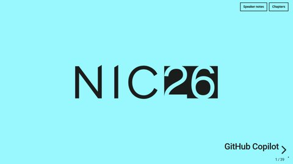](https://martinopedal.github.io/squad-terraform-session-2026-10-14/presentation/#/opening)<br>**1.** NIC 2026 opening page | [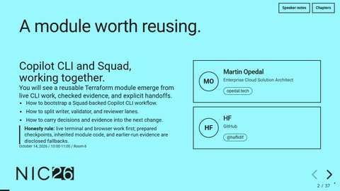](https://martinopedal.github.io/squad-terraform-session-2026-10-14/presentation/#/s01-outcome)<br>**2.** A module worth reusing | [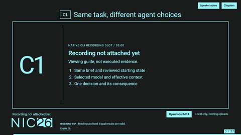](https://martinopedal.github.io/squad-terraform-session-2026-10-14/presentation/#/demo-c1)<br>**3.** Same task, different agent choices |
| [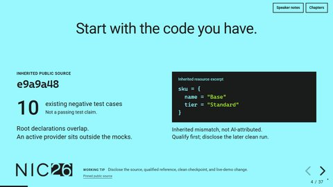](https://martinopedal.github.io/squad-terraform-session-2026-10-14/presentation/#/s03-baseline)<br>**4.** Start with the code you have | [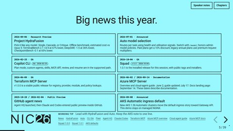](https://martinopedal.github.io/squad-terraform-session-2026-10-14/presentation/#/s04-news)<br>**5.** Big news this year | [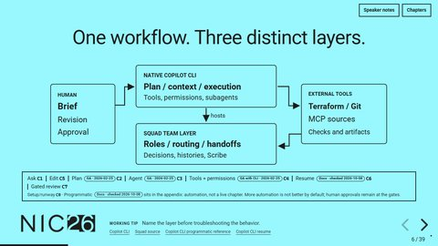](https://martinopedal.github.io/squad-terraform-session-2026-10-14/presentation/#/s04-layers)<br>**6.** One workflow. Three distinct layers |
| [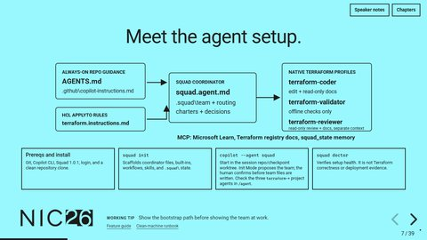](https://martinopedal.github.io/squad-terraform-session-2026-10-14/presentation/#/s07-agent-setup)<br>**7.** Meet the agent setup | [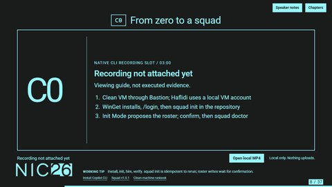](https://martinopedal.github.io/squad-terraform-session-2026-10-14/presentation/#/demo-c0)<br>**8.** From zero to a squad | [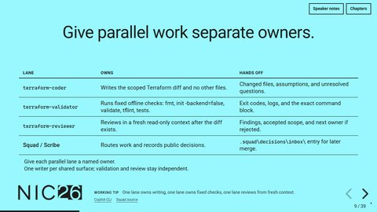](https://martinopedal.github.io/squad-terraform-session-2026-10-14/presentation/#/s05-parallel)<br>**9.** Give parallel work separate owners |
| [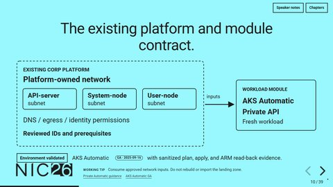](https://martinopedal.github.io/squad-terraform-session-2026-10-14/presentation/#/s06-contract)<br>**10.** Fit the platform you already have | [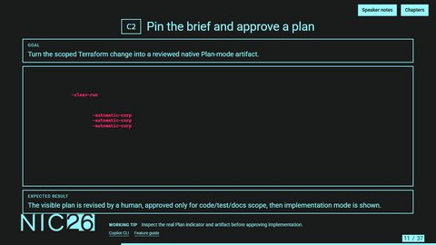](https://martinopedal.github.io/squad-terraform-session-2026-10-14/presentation/#/demo-c2)<br>**11.** Pin the brief and approve a plan | [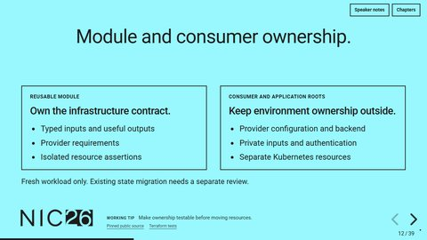](https://martinopedal.github.io/squad-terraform-session-2026-10-14/presentation/#/s08-plan-boundary)<br>**12.** Extract a module, not an environment |
| [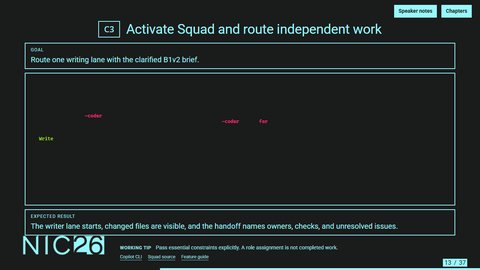](https://martinopedal.github.io/squad-terraform-session-2026-10-14/presentation/#/demo-c3)<br>**13.** Activate Squad and route independent work | [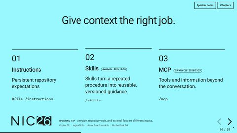](https://martinopedal.github.io/squad-terraform-session-2026-10-14/presentation/#/s10-tool-roles)<br>**14.** Give context the right job | [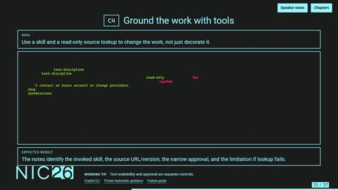](https://martinopedal.github.io/squad-terraform-session-2026-10-14/presentation/#/demo-c4)<br>**15.** Ground the work with tools |
| [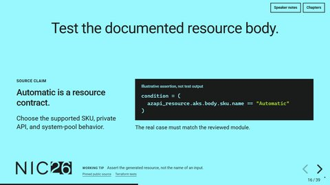](https://martinopedal.github.io/squad-terraform-session-2026-10-14/presentation/#/s12-source-check)<br>**16.** Turn the source into an assertion | [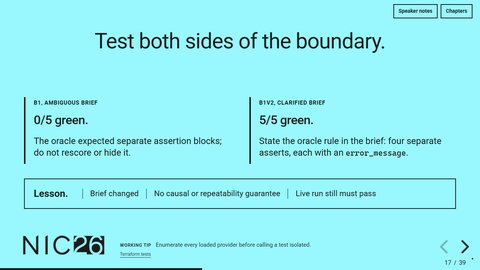](https://martinopedal.github.io/squad-terraform-session-2026-10-14/presentation/#/s13-test-gap)<br>**17.** Test both sides of the boundary | [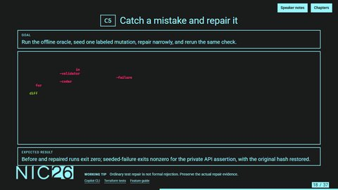](https://martinopedal.github.io/squad-terraform-session-2026-10-14/presentation/#/demo-c5)<br>**18.** Catch a mistake and repair it |
| [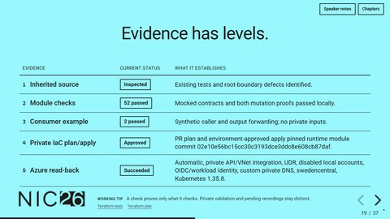](https://martinopedal.github.io/squad-terraform-session-2026-10-14/presentation/#/s15-proof)<br>**19.** Evidence has levels | [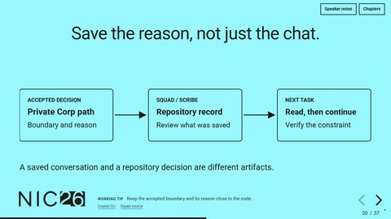](https://martinopedal.github.io/squad-terraform-session-2026-10-14/presentation/#/s16-continuity)<br>**20.** Save the reason, not just the chat | [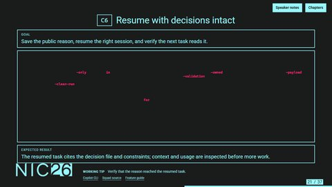](https://martinopedal.github.io/squad-terraform-session-2026-10-14/presentation/#/demo-c6)<br>**21.** Resume with decisions intact |
| [](https://martinopedal.github.io/squad-terraform-session-2026-10-14/presentation/#/s18-memory)<br>**22.** Three places to keep context | [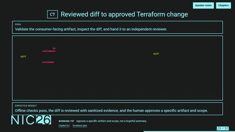](https://martinopedal.github.io/squad-terraform-session-2026-10-14/presentation/#/demo-c7)<br>**23.** Reviewed diff to approved Terraform change | [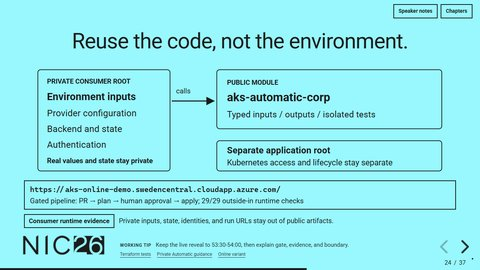](https://martinopedal.github.io/squad-terraform-session-2026-10-14/presentation/#/s20-consumer)<br>**24.** Reuse the code, not the environment |
| [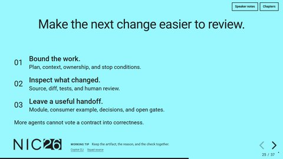](https://martinopedal.github.io/squad-terraform-session-2026-10-14/presentation/#/s21-limits)<br>**25.** Make the next change easier to review | [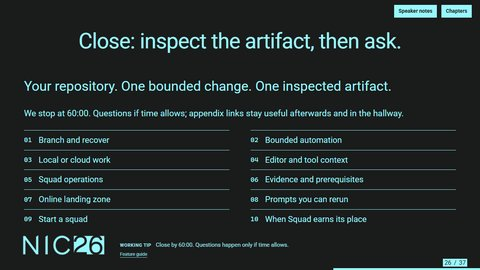](https://martinopedal.github.io/squad-terraform-session-2026-10-14/presentation/#/s22-questions)<br>**26.** Which part would you inspect? | [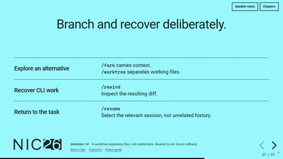](https://martinopedal.github.io/squad-terraform-session-2026-10-14/presentation/#/a-cli-controls)<br>**27.** Branch and recover deliberately |
| [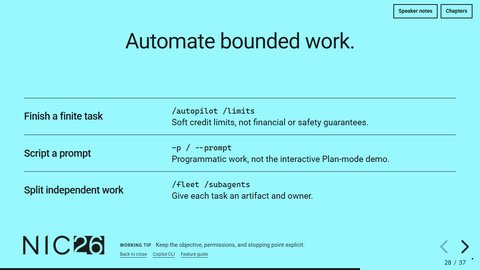](https://martinopedal.github.io/squad-terraform-session-2026-10-14/presentation/#/a-automation)<br>**28.** Automate bounded work | [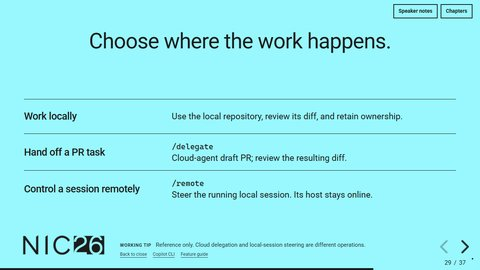](https://martinopedal.github.io/squad-terraform-session-2026-10-14/presentation/#/a-handoffs)<br>**29.** Choose where the work happens | [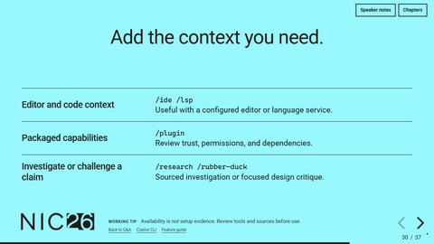](https://martinopedal.github.io/squad-terraform-session-2026-10-14/presentation/#/a-integrations)<br>**30.** Add the context you need |
| [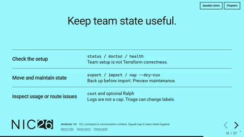](https://martinopedal.github.io/squad-terraform-session-2026-10-14/presentation/#/a-squad-ops)<br>**31.** Keep team state useful | [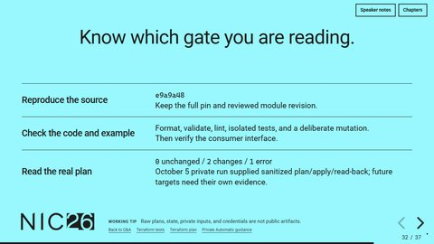](https://martinopedal.github.io/squad-terraform-session-2026-10-14/presentation/#/a-evidence)<br>**32.** Know which gate you are reading | [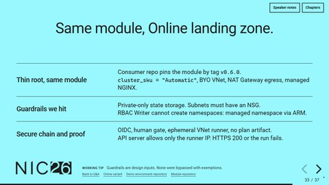](https://martinopedal.github.io/squad-terraform-session-2026-10-14/presentation/#/a-online)<br>**33.** Same module, Online landing zone |
| [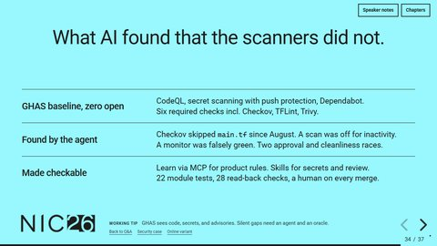](https://martinopedal.github.io/squad-terraform-session-2026-10-14/presentation/#/a-security)<br>**34.** What AI found that the scanners did not | [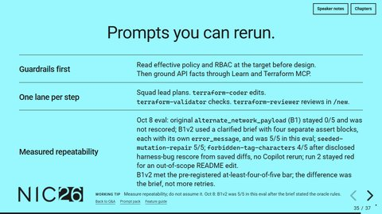](https://martinopedal.github.io/squad-terraform-session-2026-10-14/presentation/#/a-prompts)<br>**35.** Prompts you can rerun | [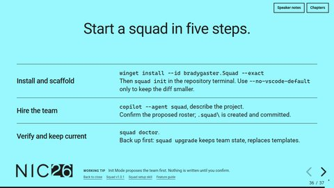](https://martinopedal.github.io/squad-terraform-session-2026-10-14/presentation/#/a-bootstrap)<br>**36.** Start a squad in five steps |
| [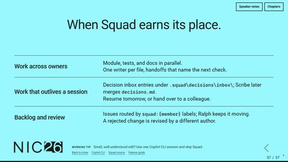](https://martinopedal.github.io/squad-terraform-session-2026-10-14/presentation/#/a-use-cases)<br>**37.** When Squad earns its place |  |  |

<!-- preview:end -->

## Open the presentation

From this directory, run `npm run serve`, then open <http://127.0.0.1:4173/presentation/index.html> in Edge or Chromium. The server exposes only the public worktree, so links to the public documents work too. The generated `index.html` contains Reveal.js 5.2.1, its notes and highlight plugins, the theme, and the diagrams. Serving the existing HTML requires Python, not npm dependencies. The equivalent command is:

```powershell
python -m http.server 4173 --bind 127.0.0.1 --directory ..
```

Press `S` or select **Speaker notes** to open current/next slides, the complete spoken notes, and the timer. Allow the local popup. The spoken script appears first; expand **Operator cues and timing** for capture details and handoffs. Use arrows or Page Up/Down to advance, Home/End for the first/last slide, Escape for overview, and **Chapters** for named navigation. Video controls retain their native keyboard behavior while focused. There is no automatic slide advance or video autoplay.

In overview, click a thumbnail or use arrows to select a slide, then Escape to return to it. Thumbnail links and video controls remain inert. On exit, only the active slide becomes interactive; the approved presenter-shortcut behavior is unchanged.

The first slide is a pre-show NIC 2026 opening page and does not consume session time. The 25 timed main slides allocate 29 minutes to live demo chapters (C0-C7), 24 minutes to other explanation, and seven minutes to Q&A. Eleven appendix slides are question-driven references, not additional scheduled content. [The talk track](../docs/talk-track.md) includes both speakers and a separately labeled prepared Q&A fallback.

## Build

The exact package versions and lock file make the deck build reproducible. The lock omits machine-specific registry URLs, so consumers use their configured registry:

```powershell
npm ci --no-audit --no-fund
npm run build
npm test
npm run preview   # refresh the GitHub preview images and gallery from the QA captures
```

Edit `src\slides.mjs` for composition, `src\theme.css` for the fixed NIC 2026 template treatment, and `src\runtime.js` for presenter/media behavior. The build reads complete notes from `..\docs\talk-track.md`. Keep its stable slide headings. Diagrams are authored as static SVG in `src\diagrams.mjs` and inlined at build time, with no browser diagram renderer.

The design is fixed: 1280 x 720, official NIC 2026 cyan and ink surfaces, embedded Roboto, NIC26 logos, and restrained motion. This is a screen-only deck. No print or PowerPoint output is maintained.

Before each content revision, preserve the previous generated HTML outside the release package. Increment `src\version.json` in the same revision. Keep `0.x` until the presenters approve the final content.

## Live demos and optional fallback evidence

C0-C7 are live demo slides. Each chapter card shows the goal, the command or prompt to type, and the expected result. Speaker notes contain the driver, what to point at, the hand-off line, and an **Offline fallback** line. Recordings are optional fallback evidence, not a deck dependency.

Only genuine Copilot CLI with Squad selected, standalone or in a real integrated terminal, qualifies as fallback product evidence. Capture controllers stay off-screen as external tooling. Do not use custom-viewer recordings, artifact-pilot frames, or fabricated terminal output.

Source qualification may finish before delivery. The live chapter must execute from a disclosed clean checkpoint or explicitly use the Offline fallback line. Do not substitute prior qualification output for a live result. If optional fallback recordings are used later, record the qualification revision, take-start checkpoint, prepared code and Squad state, and the actual change executed in the take.

Deck 0.19.1 removes on-screen media attachment controls. Keep fallback recordings/screenshots outside the public package unless presenters explicitly decide to publish them in a later build.

The legacy `src\media.json` file remains harmless metadata for optional fallback review, but the current live deck does not render media placeholders or local MP4 controls.

Retain provenance and edit records outside the deck's public package. Durations are unchanged: C0 3 minutes, C1 3, C2 4, C3 4, C4 4, C5 5, C6 3, and C7 3. The fallback owner must verify the actual UI, selected agent, content, and duration before citing a capture.

Pin and display the actual live-demo executable versions. Current validation is Copilot CLI 1.0.93 and Squad 1.0.1 on October 8, 2026; earlier probes in the [verified feature guide](../docs/feature-guide.md) are explicitly historical. `--no-auto-update` is not a version selector. C2 must retain interactive Plan mode and human approval; never use the auto-approving `--plan --mode autopilot` combination. Rehearse current documented guards and instruction inheritance in the chosen build instead of treating help as UI evidence.

Update `src\evidence.json` only from approved, sanitized evidence. A source inspection is not a test pass. Local tests aren't proof of Azure deployment or policy compliance; cite only approved sanitized Azure validation facts. Do not insert private scope names, account identifiers, state, credentials, raw plans, or private policy links.

Long MP4 files are the documented exception to single-file delivery. Keep `index.html` and `media\` together. Internet access is not needed for slides, notes, or local video. Public source links are optional reading, not runtime dependencies.

## Check the build

Use an isolated Python environment and the installed Edge browser:

```powershell
python -m venv .venv
.\.venv\Scripts\python.exe -m pip install -r requirements.txt
npm test
```

The check first exercises the live-demo slide contract, then starts its own loopback server. It blocks external browser requests, captures every slide/fragment at 1280 x 720 and 1920 x 1080, and checks structure, overflow, contrast/accessibility, keyboard navigation, notes, and offline packaging. The check shuts down its server and browser when finished.

Results and screenshots go to `qa\`. Automated checks do not replace looking at the screenshots or running a full two-speaker rehearsal. The final QA report distinguishes tested presentation behavior from live CLI execution, native profile-selection evidence, and sanitized Azure validation limits.

Local verification and visual-review reports remain under ignored `qa\` and reviewer artifact directories. They contain build/browser results, per-slide observations, and the remaining stage-release gates. They are not part of the public package; public release summaries must be sanitized separately.
