# Present and maintain the deck

Martin, Haflidi, and the presentation operator can use this directory to build, rehearse, and deliver the offline Reveal.js deck. Contributors can update approved evidence without replacing the slide design or the spoken script.

## Preview

[](https://martinopedal.github.io/squad-terraform-session-2026-10-14/presentation/)

<!-- preview:start -->

Generated by `npm run preview` from the QA captures (39 slides, final fragment state). Select a thumbnail to open that slide in the [live deck](https://martinopedal.github.io/squad-terraform-session-2026-10-14/presentation/).

| | | |
|---|---|---|
| [](https://martinopedal.github.io/squad-terraform-session-2026-10-14/presentation/#/opening)<br>**1.** NIC 2026 | [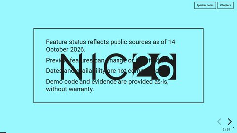](https://martinopedal.github.io/squad-terraform-session-2026-10-14/presentation/#/legal-notice)<br>**2.** Legal and futures notice | [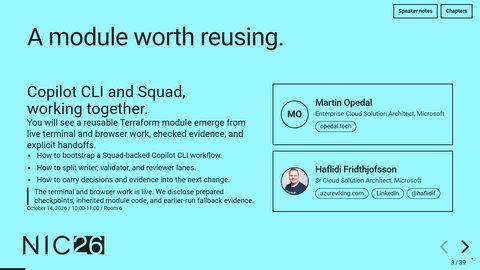](https://martinopedal.github.io/squad-terraform-session-2026-10-14/presentation/#/s01-outcome)<br>**3.** A module worth reusing |
| [](https://martinopedal.github.io/squad-terraform-session-2026-10-14/presentation/#/s03-baseline)<br>**4.** Start with the code you have | [](https://martinopedal.github.io/squad-terraform-session-2026-10-14/presentation/#/s04-news)<br>**5.** Big news this year | [](https://martinopedal.github.io/squad-terraform-session-2026-10-14/presentation/#/s04-layers)<br>**6.** One workflow. Three distinct layers |
| [](https://martinopedal.github.io/squad-terraform-session-2026-10-14/presentation/#/s07-agent-setup)<br>**7.** Meet the agent setup | [](https://martinopedal.github.io/squad-terraform-session-2026-10-14/presentation/#/demo-c0)<br>**8.** From zero to a squad | [](https://martinopedal.github.io/squad-terraform-session-2026-10-14/presentation/#/s05-parallel)<br>**9.** Give parallel work separate owners |
| [](https://martinopedal.github.io/squad-terraform-session-2026-10-14/presentation/#/s06-contract)<br>**10.** The existing platform and module contract | [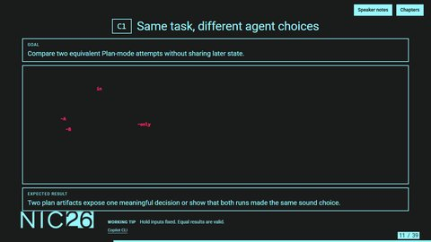](https://martinopedal.github.io/squad-terraform-session-2026-10-14/presentation/#/demo-c1)<br>**11.** Same task, different agent choices | [](https://martinopedal.github.io/squad-terraform-session-2026-10-14/presentation/#/s08-plan-boundary)<br>**12.** Module and consumer ownership |
| [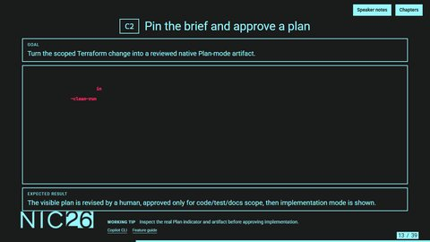](https://martinopedal.github.io/squad-terraform-session-2026-10-14/presentation/#/demo-c2)<br>**13.** Pin the brief and approve a plan | [](https://martinopedal.github.io/squad-terraform-session-2026-10-14/presentation/#/s10-tool-roles)<br>**14.** Instructions, skills, and MCP | [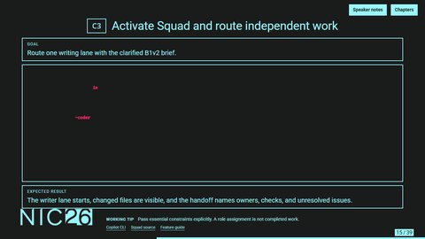](https://martinopedal.github.io/squad-terraform-session-2026-10-14/presentation/#/demo-c3)<br>**15.** Activate Squad and route independent work |
| [](https://martinopedal.github.io/squad-terraform-session-2026-10-14/presentation/#/s12-source-check)<br>**16.** Test the documented resource body | [](https://martinopedal.github.io/squad-terraform-session-2026-10-14/presentation/#/s13-test-gap)<br>**17.** Test both sides of the boundary | [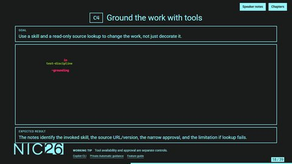](https://martinopedal.github.io/squad-terraform-session-2026-10-14/presentation/#/demo-c4)<br>**18.** Ground the work with tools |
| [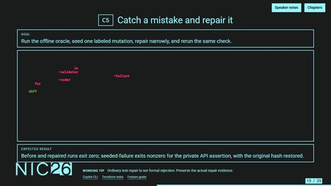](https://martinopedal.github.io/squad-terraform-session-2026-10-14/presentation/#/demo-c5)<br>**19.** Catch a mistake and repair it | [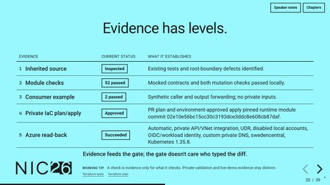](https://martinopedal.github.io/squad-terraform-session-2026-10-14/presentation/#/s15-proof)<br>**20.** What each check covers | [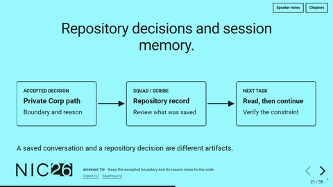](https://martinopedal.github.io/squad-terraform-session-2026-10-14/presentation/#/s16-continuity)<br>**21.** Repository decisions and session memory |
| [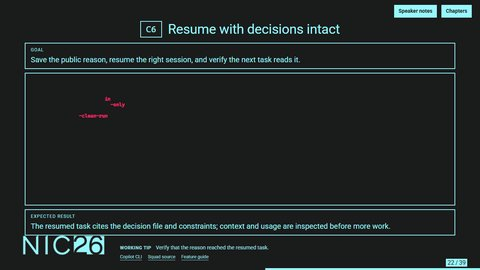](https://martinopedal.github.io/squad-terraform-session-2026-10-14/presentation/#/demo-c6)<br>**22.** Resume with decisions intact | [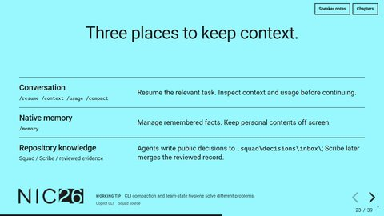](https://martinopedal.github.io/squad-terraform-session-2026-10-14/presentation/#/s18-memory)<br>**23.** Three places to keep context | [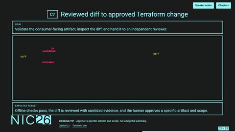](https://martinopedal.github.io/squad-terraform-session-2026-10-14/presentation/#/demo-c7)<br>**24.** Reviewed diff to approved Terraform change |
| [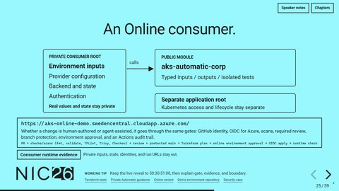](https://martinopedal.github.io/squad-terraform-session-2026-10-14/presentation/#/s20-consumer)<br>**25.** An Online consumer | [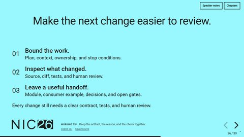](https://martinopedal.github.io/squad-terraform-session-2026-10-14/presentation/#/s21-limits)<br>**26.** Make the next change easier to review | [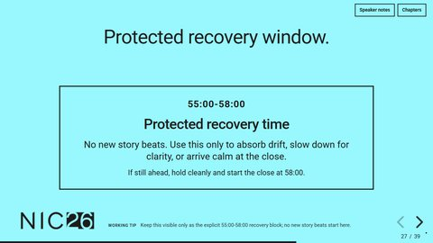](https://martinopedal.github.io/squad-terraform-session-2026-10-14/presentation/#/buffer-recovery)<br>**27.** Protected recovery window |
| [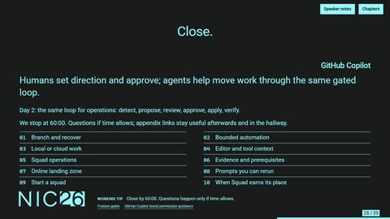](https://martinopedal.github.io/squad-terraform-session-2026-10-14/presentation/#/s22-questions)<br>**28.** Close | [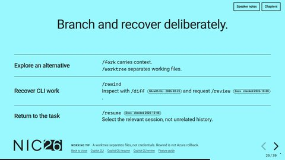](https://martinopedal.github.io/squad-terraform-session-2026-10-14/presentation/#/a-cli-controls)<br>**29.** Branch and recover deliberately | [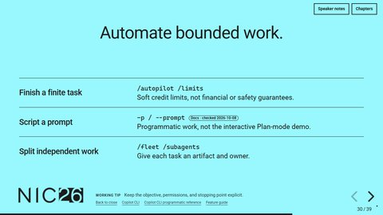](https://martinopedal.github.io/squad-terraform-session-2026-10-14/presentation/#/a-automation)<br>**30.** Automate bounded work |
| [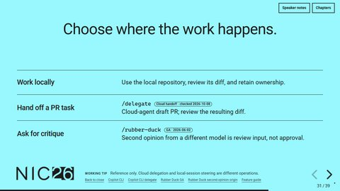](https://martinopedal.github.io/squad-terraform-session-2026-10-14/presentation/#/a-handoffs)<br>**31.** Choose where the work happens | [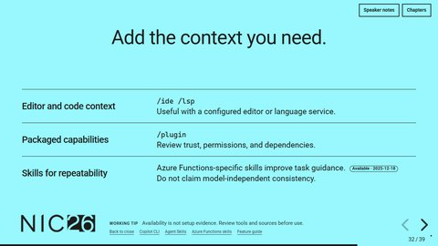](https://martinopedal.github.io/squad-terraform-session-2026-10-14/presentation/#/a-integrations)<br>**32.** Add the context you need | [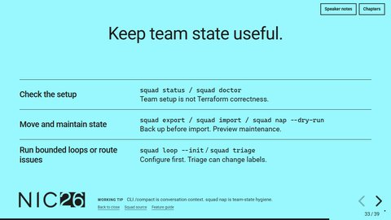](https://martinopedal.github.io/squad-terraform-session-2026-10-14/presentation/#/a-squad-ops)<br>**33.** Keep team state useful |
| [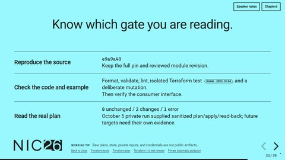](https://martinopedal.github.io/squad-terraform-session-2026-10-14/presentation/#/a-evidence)<br>**34.** Know which gate you are reading | [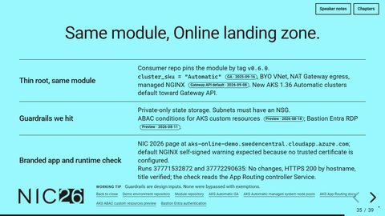](https://martinopedal.github.io/squad-terraform-session-2026-10-14/presentation/#/a-online)<br>**35.** Same module, Online landing zone | [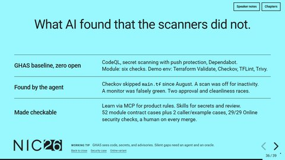](https://martinopedal.github.io/squad-terraform-session-2026-10-14/presentation/#/a-security)<br>**36.** What AI found that the scanners did not |
| [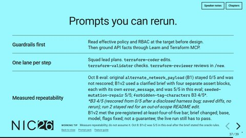](https://martinopedal.github.io/squad-terraform-session-2026-10-14/presentation/#/a-prompts)<br>**37.** Prompts you can rerun | [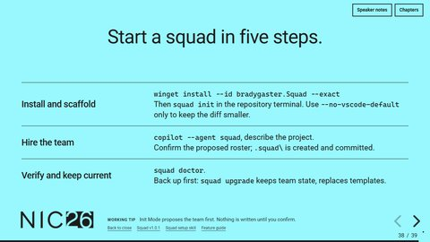](https://martinopedal.github.io/squad-terraform-session-2026-10-14/presentation/#/a-bootstrap)<br>**38.** Start a squad in five steps | [](https://martinopedal.github.io/squad-terraform-session-2026-10-14/presentation/#/a-use-cases)<br>**39.** When Squad earns its place |

<!-- preview:end -->

A five-slide companion cut is generated at [`short/index.html`](short/index.html). It reuses the same inlined Reveal.js runtime, theme, and shared session data.

## Open the presentation

From this directory, run `npm run serve`, then open <http://127.0.0.1:4173/presentation/index.html> in Edge or Chromium. The server exposes only the public worktree, so links to the public documents work too. The generated `index.html` contains Reveal.js 5.2.1, its notes and highlight plugins, the theme, and the diagrams. Serving the existing HTML requires Python, not npm dependencies. The equivalent command is:

```powershell
python -m http.server 4173 --bind 127.0.0.1 --directory ..
```

Press `S` or select **Speaker notes** to open current/next slides, the complete spoken notes, and the timer. Allow the local popup. The spoken script appears first; expand **Operator cues and timing** for capture details and handoffs. Use arrows or Page Up/Down to advance, Home/End for the first/last slide, Escape for overview, and **Chapters** for named navigation. Video controls retain their native keyboard behavior while focused. There is no automatic slide advance or video autoplay.

In overview, click a thumbnail or use arrows to select a slide, then Escape to return to it. Thumbnail links and video controls remain inert. On exit, only the active slide becomes interactive; the approved presenter-shortcut behavior is unchanged.

The first two slides are untimed pre-show material (opening page and legal notice) and do not consume session time. The 26 timed main slides allocate 3 minutes to the intro, 52 minutes of planned content before recovery (including 29 live demo minutes across C0-C7 and 23 explanation minutes), a visible 3-minute protected recovery window, and a 2-minute close. There is no scheduled Q&A; questions happen only if time allows, and the appendix stays after the close for hallway/reference use.

## Build

The exact package versions and lock file make the deck build reproducible. The lock omits machine-specific registry URLs, so consumers use their configured registry:

```powershell
npm ci --no-audit --no-fund
npm run build
npm run preview   # refresh the GitHub preview images and gallery from the QA captures
```

Before `npm test`, create the local Python environment and install the QA requirements:

```powershell
python -m venv .venv
.\.venv\Scripts\python.exe -m pip install -r requirements.txt
npm test
```

Edit `src\slides.mjs` for composition, `src\theme.css` for the fixed NIC 2026 template treatment, and `src\runtime.js` for presenter/media behavior. The build reads complete notes from `..\docs\talk-track.md`. Keep its stable slide headings. Diagrams are authored as static SVG in `src\diagrams.mjs` and inlined at build time, with no browser diagram renderer.

The design is fixed: 1280 x 720, official NIC 2026 cyan and ink surfaces, embedded Roboto, NIC26 logos, and restrained motion. This is a screen-only deck. No print or PowerPoint output is maintained.

Before each content revision, preserve the previous generated HTML outside the release package. Increment `src\version.json` in the same revision. Keep `0.x` until the presenters approve the final content.

## Live demos and fallback notes

C0-C7 are live demo slides. Each chapter card shows the goal, the command or prompt to type, and the expected result. Speaker notes contain the driver, what to point at, the hand-off line, and an **Offline fallback** line.

Only genuine Copilot CLI with Squad selected, standalone or in a real integrated terminal, qualifies as fallback product evidence. Capture controllers stay off-screen as external tooling. Do not use custom-viewer captures, artifact-pilot frames, or fabricated terminal output.

Source qualification may finish before delivery. The live chapter must execute from a disclosed clean checkpoint or explicitly use the Offline fallback line. Do not substitute prior qualification output for a live result.

Deck 0.22.1 follows the 60-minute run-plan contract with 55 minutes of scripted content, a visible 55:00-58:00 protected recovery window, and the five-slide companion deck.

The legacy `src\media.json` file remains harmless metadata for evidence review, but the current live deck does not render chapter-media placeholders or autoplay controls.

Retain provenance and edit records outside the deck's public package. Durations are unchanged: C0 3 minutes, C1 3, C2 4, C3 4, C4 4, C5 5, C6 3, and C7 3; C0 now runs 05:30-08:30 before C1. The fallback owner must verify the actual UI, selected agent, content, and duration before citing evidence.

Pin and display the actual live-demo executable versions. Current validation is Copilot CLI 1.0.93 and Squad 1.0.1 on October 8, 2026; earlier probes in the [verified feature guide](../docs/feature-guide.md) are explicitly historical. `--no-auto-update` is not a version selector. C2 must retain interactive Plan mode and human approval; never use the auto-approving `--plan --mode autopilot` combination. Rehearse current documented guards and instruction inheritance in the chosen build instead of treating help as UI evidence.

Update `src\evidence.json` only from approved, sanitized evidence. A source inspection is not a test pass. Local tests are not Azure deployment or policy compliance evidence; cite only approved sanitized Azure validation facts. Do not insert private scope names, account identifiers, state, credentials, raw plans, or private policy links.

Keep `index.html` and `short\index.html` with the generated manifests. Internet access is not needed for slides or speaker notes. Public source links are optional reading, not runtime dependencies.

## Check the build

Use an isolated Python environment and the installed Edge browser. `npm test` expects `.\.venv\Scripts\python.exe` to exist in this directory:

```powershell
python -m venv .venv
.\.venv\Scripts\python.exe -m pip install -r requirements.txt
npm test
```

The check first exercises the live-demo slide contract, all short-deck document paths, and the actual bootstrap script with safe native executable mocks (PowerShell 7 is required). Writing checks cover full and short slide copy, notes, public docs, and the Haflidi page. They also protect manual bootstrap, human team confirmation, and the Management/Corp evidence boundary. The check then starts loopback browser checks for both decks. The short-deck check measures actual card and text bounds against the body, footer, canvas, and controls and verifies all nine documentation links by HTTP. Both decks are captured at 1280 x 720 and 1920 x 1080 with external browser requests blocked; the full deck includes every fragment. Structure, overflow, contrast/accessibility, keyboard navigation, notes, and offline packaging are checked. Servers and browsers shut down when finished.

Results and screenshots go to `qa\` (short-deck captures under `qa\short\`). Automated checks do not replace looking at the screenshots, the [manual clean-VM bootstrap qualification](../docs/bootstrap.md), or running a full two-speaker rehearsal. The final QA report distinguishes tested presentation behavior from live CLI execution, native profile-selection evidence, and sanitized Azure validation limits.

Local verification and visual-review reports remain under ignored `qa\` and reviewer artifact directories. They contain build/browser results, per-slide observations, and the remaining stage-release gates. They are not part of the public package; public release summaries must be sanitized separately.
